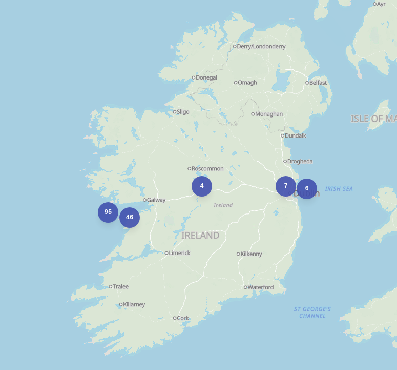
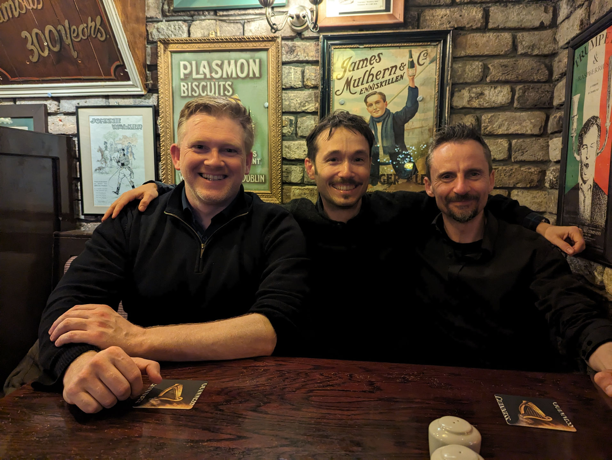
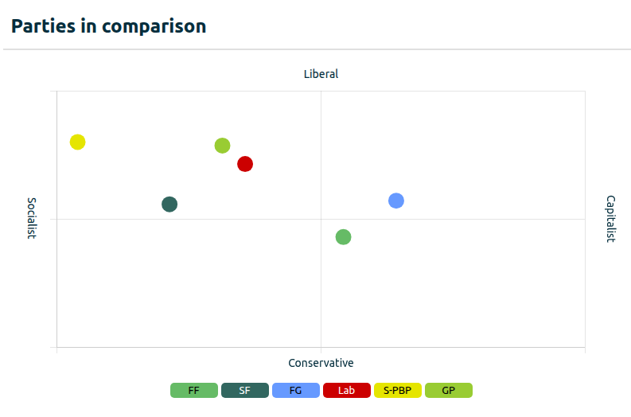
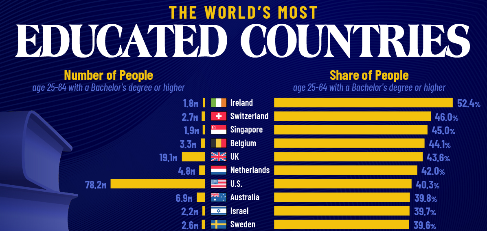
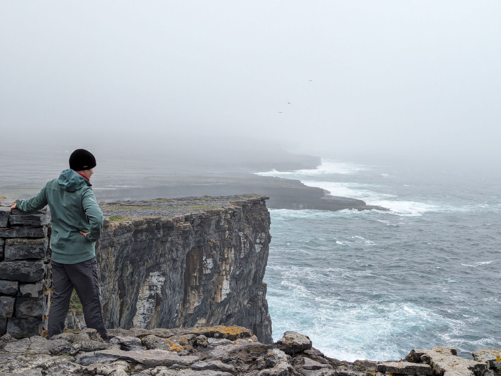
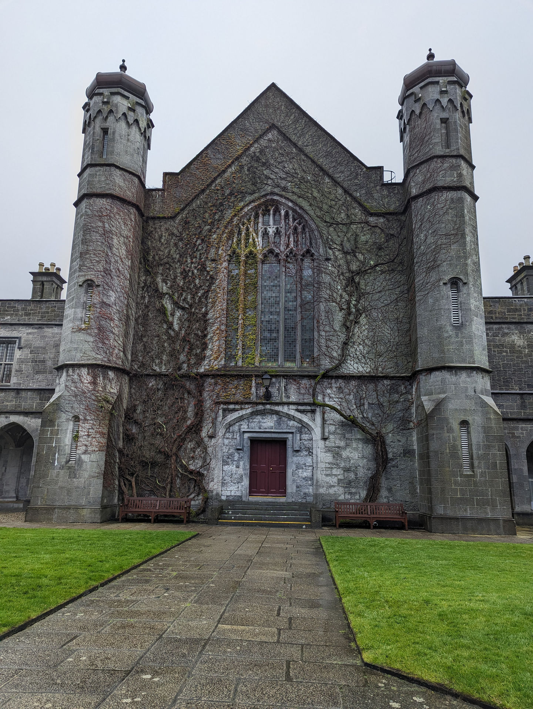

## How Universal Probabilistic Programming Languages Democratize Modeling in Computational Biology

or

## My first keynote experience

::: notes
-   On April 10, 2024
-   Invited to give a keynote at the University of Galway, School of Mathematical and Statistical Sciences, Research Day
-   Invitation based on talk I gave at a bioinformatics conference in Lyon the summer before
:::

------------------------------------------------------------------------

::: notes
-   Wasn't sure what to expect

-   But always loved Ireland

-   Lord of the Rings and all...

-   The Irish are very hospitable

-   On the night of my arrival my host took me to this restaurant by the ocean

-   The weather was bad

-   Guiness and sea food were great
:::

## Irish culture and language

::: r-fit-text
Cathal Seoighe
:::

::: notes
-   Local names: Cathal Seoighe, Ard Bia, Ty Molly
-   Irish language very much alive
-   Irish cultural identity based on anti-colonial struggle
-   Don't shy away from political conversation
-   Discussed things like the Good Friday accords and Palestine
:::

## Irish politics

 <https://politpro.eu/en/ireland/parties>

::: notes
-   No true right-wing parties
-   And all the parties that we've heard of are socialist-liberal
-   Dark green: Sinn Féin
-   Red: Labor
-   Light green: Green Party
-   The ultra-left party is called "Solidarity-People before Profits"
-   And the two centrists parties are called: green (Fiana Fáil and Fine Gael)
:::

------------------------------------------------------------------------

::: notes
-   Also Connor McGregor who wants to run for president on a Trumpist platform
-   Has no chance whatsover
:::

## Economics

GDP ranking in Europe:

 Source: Visual Capitalist

::: notes
-   Figures distorted by multinational corporations shifting their revenues to Ireland for tax purposes
:::

## Education

 Source: Visual Capitalist

## Nature

::: notes
-   It rains a lot, but the nature is...
:::

------------------------------------------------------------------------

::: notes
-   ...nothing short of breathtaking
:::

## Presentation at Uni Galway

 

[Slides](https://senderov.info/2024-galway-slides/)

::: notes
-  Really enjoyed giving this type of talk
-  Cover more topics than in a typical presentation/ perspective
-  After, got to judge a student competition on talks and posters
-  Sat down with Cathal's student and drafted some plans for her
-  Not easy, but what I found enjoyable is asking open questions to the students about their work
-  Also I really liked the recognition that I was getting and would like to get to this stage of my career
:::

## Demo

[Jupyter Server](http://senderov.sf.ddns.bulsat.com:8888/tree?token=1ac8122f99d7f5419a8f16b5b0a1acc002695a6eeb58e80f)